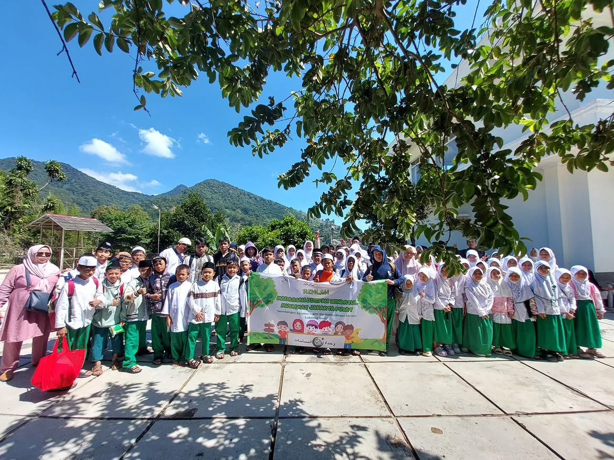

# Website Edukasi Madrasah Wihdatul Muslimat

## Deskripsi Proyek

Proyek ini merupakan website edukasi untuk **Madrasah Diniyah Takmiliyah Wihdatul Muslimat** di Menteng, Jakarta Pusat. Website menampilkan profil madrasah, kurikulum, wawasan edukasi, media pembelajaran, kegiatan, galeri, dan informasi kontak.

Website dibuat untuk memenuhi tugas UAS mata kuliah **Pemrograman Web I**. Komponennya disusun berdasarkan materi Pertemuan 1 sampai Pertemuan 15, seperti struktur HTML, paragraf, heading, text formatting, link, gambar, tabel, list, form, elemen semantik, video, audio, CSS, dan JavaScript.

Website ini termasuk **single-page website** karena seluruh konten utama berada dalam satu file `index.html`. Ketika menu dipilih, halaman akan bergulir menuju bagian yang mempunyai `id` sesuai dengan tujuan link.

## Tujuan Proyek

1. Menyediakan informasi mengenai Madrasah Wihdatul Muslimat.
2. Menampilkan kurikulum dan kegiatan pembelajaran madrasah.
3. Memberikan wawasan mengenai pentingnya pendidikan agama bagi anak.
4. Menampilkan dokumentasi kegiatan santri.
5. Menerapkan materi HTML, CSS, dan JavaScript dalam satu proyek.
6. Membuat tampilan yang dapat digunakan pada komputer, tablet, dan ponsel.

## Teknologi yang Digunakan

| Teknologi | Fungsi |
| --- | --- |
| HTML5 | Membuat struktur dan isi website. |
| CSS3 | Mengatur warna, ukuran, posisi, efek, dan tampilan responsif. |
| JavaScript | Membuat menu, filter galeri, form demo, dan tombol kembali ke atas menjadi interaktif. |
| Google Fonts | Menyediakan font `DM Sans` dan `Playfair Display`. |
| YouTube Embed | Menampilkan video pembelajaran dari YouTube. |

Proyek menggunakan **Custom CSS** dan **Vanilla JavaScript**, sehingga tidak menggunakan Bootstrap, Tailwind CSS, React, atau framework lainnya.

## Struktur File

```text
.
├── index.html
├── style.css
├── script.js
├── README.md
└── assets/
    ├── logo-madrasah.jpg
    ├── identitas.jpg
    └── kegiatan-1.jpeg sampai kegiatan-17.jpeg
```

Keterangan:

- `index.html` berisi seluruh struktur dan konten website.
- `style.css` berisi seluruh aturan desain dan tampilan responsif.
- `script.js` berisi fungsi interaktif website.
- Folder `assets` menyimpan logo dan gambar kegiatan madrasah.
- `README.md` berisi dokumentasi dan penjelasan source code.

## Hubungan Antarfile

HTML menghubungkan CSS melalui:

```html
<link rel="stylesheet" href="style.css">
```

HTML menghubungkan JavaScript melalui:

```html
<script src="script.js"></script>
```

Alur kerjanya adalah:

1. Browser membaca struktur dan konten dari `index.html`.
2. Browser mengambil `style.css` untuk mengatur tampilan.
3. Browser menjalankan `script.js` untuk menambahkan interaksi.
4. HTML mengambil gambar lokal dari folder `assets`.
5. HTML mengambil video YouTube dan audio contoh melalui internet.

---

# Penerapan Materi Pertemuan 1-15

## Ringkasan Penerapan

| Pertemuan | Materi | Penerapan pada Proyek |
| --- | --- | --- |
| 1 | Pengenalan dasar HTML | Menggunakan `DOCTYPE`, `html`, `head`, `title`, dan `body`. |
| 2 | Tag, elemen, dan atribut | Menggunakan tag HTML beserta atribut `id`, `class`, `href`, `src`, dan `alt`. |
| 3 | Paragraf | Menggunakan `<p>`, `<div>`, dan `<br>`. |
| 4 | Heading, komentar, dan text formatting | Menggunakan `<h1>` sampai `<h3>`, komentar HTML, `<b>`, `<strong>`, `<em>`, dan `<small>`. |
| 5 | Link | Menggunakan link internal, eksternal, anchor, gambar sebagai link, dan `target="_blank"`. |
| 6 | Gambar dan tabel | Menggunakan ``, `<figure>`, `<figcaption>`, dan tabel kurikulum. |
| 7 | List | Menggunakan unordered list `<ul>` dan ordered list `<ol>`. |
| 8 | Modul tidak disertakan | Tidak dipetakan secara khusus karena file Pertemuan 8 tidak tersedia. |
| 9 | Form | Menggunakan `<form>`, `<label>`, `<input>`, `<textarea>`, dan tombol submit. |
| 10 | Elemen semantik | Menggunakan `<header>`, `<nav>`, `<main>`, `<section>`, `<article>`, `<figure>`, dan `<footer>`. |
| 11 | Video HTML | Menggunakan YouTube `<iframe>` dan contoh `<video>` dengan `<source>`. |
| 12 | Audio HTML | Menggunakan `<audio controls>` dan `<source>`. |
| 13 | Project website | Menggabungkan materi menjadi website edukasi yang lengkap. |
| 14 | Dasar CSS | Menggunakan external CSS, selector, property, dan value. |
| 15 | Lima selector CSS | Menggunakan tag, class, ID, attribute, dan universal selector. |

## Pertemuan 1 - Pengenalan Dasar HTML

Struktur dasar berada pada awal `index.html`:

```html
<!DOCTYPE html>
<html lang="id">
<head>
  <meta charset="UTF-8">
  <title>Madrasah Wihdatul Muslimat | Portal Edukasi</title>
</head>
<body>
  <!-- Isi website -->
</body>
</html>
```

Penjelasan:

- `<!DOCTYPE html>` menyatakan dokumen menggunakan HTML5.
- `<html lang="id">` menjadi elemen utama dan menyatakan bahasa Indonesia.
- `<head>` menyimpan informasi halaman yang dibaca browser.
- `<title>` menentukan tulisan pada tab browser.
- `<body>` membungkus seluruh isi yang tampil.
- Nama `index.html` digunakan agar file otomatis menjadi halaman awal saat masuk ke hosting.

## Pertemuan 2 - Tag, Elemen, dan Atribut

Tag merupakan penanda HTML, elemen merupakan bagian lengkap dari tag pembuka sampai tag penutup, sedangkan atribut memberikan informasi tambahan.

```html

```

Penjelasan:

- `` adalah tag gambar.
- Keseluruhan kode tersebut merupakan elemen gambar.
- `src` menentukan lokasi gambar.
- `alt` memberikan teks alternatif jika gambar tidak dapat ditampilkan.

Atribut global yang digunakan antara lain:

- `class` untuk menghubungkan elemen dengan CSS.
- `id` sebagai identitas unik dan tujuan navigasi atau JavaScript.
- `data-filter` dan `data-cat` untuk menyimpan kategori galeri.
- `title` untuk menjelaskan judul video YouTube.

## Pertemuan 3 - Membuat Paragraf

Tag `<p>` digunakan untuk menulis deskripsi pada profil, kurikulum, wawasan, kegiatan, media, dan kontak.

```html
<p>Materi yang diajarkan di madrasah mencakup tujuh bidang pembelajaran.</p>
```

Tag `<div>` digunakan sebagai pembungkus agar beberapa elemen mudah disusun dengan CSS. Tag `<br>` digunakan untuk membuat baris baru pada judul hero dan nomor statistik.

```html
<h1>
  Belajar Agama.<br>
  <em>Menumbuhkan Akhlak.</em><br>
  Menjadi Generasi Berilmu.
</h1>
```

## Pertemuan 4 - Heading, Komentar, dan Text Formatting

Heading membentuk urutan judul:

- `<h1>` untuk judul utama website.
- `<h2>` untuk judul setiap section.
- `<h3>` untuk judul kartu atau subbagian.

Komentar HTML menandai fungsi setiap bagian source code dan tidak tampil di browser.

```html
<!-- Bagian kurikulum, list, dan tabel pembelajaran -->
```

Text formatting yang digunakan:

| Tag | Fungsi | Contoh Penggunaan |
| --- | --- | --- |
| `<b>` | Membuat teks tebal secara visual. | Nomor statistik dan label informasi. |
| `<strong>` | Menyatakan teks penting. | Nama madrasah dan tahun berdiri. |
| `<em>` | Memberikan penekanan. | Teks “Menumbuhkan Akhlak”. |
| `<small>` | Membuat informasi tambahan lebih kecil. | Nomor statistik pada kartu hero. |
| `<code>` | Menampilkan nama tag sebagai kode. | Penjelasan tag `<video>`. |

## Pertemuan 5 - Membuat Link

### Link Internal

Link internal mengarah ke section pada halaman yang sama.

```html
<a href="#kurikulum">Kurikulum</a>
<section id="kurikulum">...</section>
```

Nilai `#kurikulum` mencari elemen dengan `id="kurikulum"`.

### Link Eksternal

Link eksternal mengarah ke Instagram, Kementerian Agama, MDN, atau YouTube.

```html
<a
  href="https://youtu.be/pcsWgMMDYmI"
  target="_blank"
  rel="noopener">
  Buka video di YouTube
</a>
```

- `href` menentukan alamat tujuan.
- `target="_blank"` membuka link pada tab baru.
- `rel="noopener"` menambah keamanan.

Logo header juga menjadi link karena `` diletakkan di dalam tag `<a>`.

## Pertemuan 6 - Gambar dan Tabel

### Gambar

Gambar menggunakan tag `` dengan alamat relatif menuju folder `assets`.

```html
<figure data-cat="rihlah">
  
  <figcaption>Rihlah - kebersamaan peserta didik</figcaption>
</figure>
```

- `<figure>` membungkus gambar dan keterangannya.
- `<figcaption>` memberikan keterangan gambar.
- `data-cat` menyimpan kategori yang dibaca JavaScript.

### Tabel

Tabel merangkum bidang pembelajaran dan fokus materi.

```html
<table class="curriculum-table">
  <caption>Daftar bidang pembelajaran dan fokus materi</caption>
  <thead>
    <tr>
      <th scope="col">No.</th>
      <th scope="col">Bidang Pembelajaran</th>
      <th scope="col">Fokus Materi</th>
    </tr>
  </thead>
  <tbody>
    <tr>
      <td>1</td>
      <td>Al-Qur'an</td>
      <td>Membaca dan memahami dasar-dasar Al-Qur'an.</td>
    </tr>
  </tbody>
</table>
```

Penjelasan tag tabel:

- `<table>` membungkus seluruh tabel.
- `<caption>` memberi keterangan tabel.
- `<thead>` membungkus kepala tabel.
- `<tbody>` membungkus isi tabel.
- `<tr>` membuat satu baris.
- `<th>` membuat sel judul.
- `<td>` membuat sel data.
- `scope="col"` menyatakan judul berlaku untuk satu kolom.

## Pertemuan 7 - Membuat List

Website memakai dua jenis list.

### Unordered List

```html
<ul>
  <li>Terbiasa membaca dan mempelajari Al-Qur'an.</li>
  <li>Memahami dasar keimanan dan pelaksanaan ibadah.</li>
</ul>
```

List ini digunakan untuk **Hasil Pembelajaran yang Diharapkan**.

### Ordered List

```html
<ol>
  <li>Kegiatan pembukaan dan doa bersama.</li>
  <li>Penyampaian materi oleh guru.</li>
</ol>
```

List ini digunakan untuk **Contoh Alur Kegiatan Belajar**.

## Pertemuan 8

File materi Pertemuan 8 tidak disertakan bersama bahan tugas. Oleh karena itu, README tidak menyebutkan topik khusus untuk Pertemuan 8 agar penjelasan tetap sesuai dengan materi yang tersedia.

## Pertemuan 9 - Membuat Form

Form kontak menerima nama, email, dan pesan.

```html
<form id="contactForm" action="#" method="post">
  <label>
    Nama
    <input id="name" name="name" type="text" required>
  </label>

  <label>
    Email
    <input id="email" name="email" type="email" required>
  </label>

  <label>
    Pesan
    <textarea id="message" name="message" required></textarea>
  </label>

  <button type="submit">Kirim Pesan</button>
</form>
```

Penjelasan:

- `<form>` membungkus seluruh isian.
- `action="#"` menunjukkan tujuan masih pada halaman yang sama.
- `method="post"` menunjukkan metode pengiriman data.
- `<label>` menjelaskan nama kolom.
- `<input type="text">` menerima nama.
- `<input type="email">` menerima dan memeriksa format dasar email.
- `<textarea>` menerima pesan panjang.
- `name` menjadi nama data ketika form dikirim.
- `required` membuat kolom wajib diisi.
- `<button type="submit">` mengirim form.

Form masih berupa **form demo**. JavaScript mencegah halaman berpindah, menampilkan pesan berhasil, lalu mengosongkan isian. Data belum dikirim ke email atau database karena belum menggunakan backend.

## Pertemuan 10 - Elemen Semantik

Elemen semantik menjelaskan arti bagian website.

| Elemen | Fungsi pada Website |
| --- | --- |
| `<header>` | Membungkus logo dan navigasi utama. |
| `<nav>` | Membungkus link menu. |
| `<main>` | Membungkus konten utama. |
| `<section>` | Membagi halaman menjadi beberapa bagian. |
| `<article>` | Membungkus satu kartu materi atau kegiatan. |
| `<figure>` | Membungkus gambar galeri. |
| `<figcaption>` | Memberikan keterangan gambar. |
| `<details>` | Menyimpan contoh video yang dapat dibuka dan ditutup. |
| `<summary>` | Menjadi judul yang dapat diklik pada `details`. |
| `<footer>` | Membungkus penutup website. |

## Pertemuan 11 - Menampilkan Video

Website menggunakan dua cara menampilkan video.

### Video YouTube

Link pendek YouTube tidak bisa langsung digunakan sebagai `src` pada tag `<video>`. URL diubah menjadi format embed dan ditampilkan dengan `<iframe>`.

```html
<iframe
  class="media-player"
  src="https://www.youtube.com/embed/pcsWgMMDYmI"
  title="Video pembelajaran Madrasah Wihdatul Muslimat"
  loading="lazy"
  allowfullscreen>
</iframe>
```

- `src` berisi URL embed YouTube.
- `title` menjelaskan isi video untuk aksesibilitas.
- `loading="lazy"` menunda pemuatan video.
- `allowfullscreen` mengizinkan layar penuh.

### Tag Video HTML5

Contoh tag video HTML5 tetap tersedia di dalam elemen `details`.

```html
<video class="media-player" controls preload="metadata">
  <source
    src="https://developer.mozilla.org/shared-assets/videos/flower.mp4"
    type="video/mp4">
  Browser Anda tidak mendukung video HTML5.
</video>
```

- `<video>` membuat pemutar video HTML5.
- `controls` menampilkan kontrol pemutaran.
- `preload="metadata"` hanya mengambil informasi dasar sebelum diputar.
- `<source>` menentukan alamat dan tipe file.
- Teks di dalam `<video>` menjadi fallback jika browser tidak mendukung video.

## Pertemuan 12 - Menambahkan Audio

Audio memakai tag `<audio>` dan sumber MP3 eksternal.

```html
<audio class="audio-player" controls preload="metadata">
  <source
    src="https://developer.mozilla.org/shared-assets/audio/t-rex-roar.mp3"
    type="audio/mpeg">
  Browser Anda tidak mendukung audio HTML5.
</audio>
```

Penjelasan:

- `<audio>` membuat pemutar suara.
- `controls` memberikan kendali pemutaran.
- `<source>` menentukan lokasi file audio.
- `type="audio/mpeg"` menyatakan format MP3.
- Audio tidak memakai `autoplay` agar tidak langsung berbunyi.

## Pertemuan 13 - Membuat Project Website

Materi sebelumnya digabungkan menjadi satu proyek dengan:

- Identitas dan navigasi.
- Beranda berbentuk hero.
- Profil madrasah.
- Kurikulum berupa kartu, list, dan tabel.
- Wawasan edukasi.
- Video dan audio.
- Kegiatan dan galeri.
- Form kontak.
- Footer.

Walaupun contoh modul membuat beberapa halaman, proyek ini memakai konsep single-page agar seluruh informasi dapat dilihat dalam satu halaman.

## Pertemuan 14 - Pengenalan Dasar CSS

CSS ditulis pada file terpisah bernama `style.css`. Cara ini disebut **External CSS**.

```css
.btn {
  border: 0;
  border-radius: 11px;
  padding: 12px 19px;
  cursor: pointer;
}
```

- `.btn` merupakan selector.
- Isi `{ }` merupakan blok deklarasi.
- `border-radius` dan `padding` merupakan property.
- `11px` dan `12px 19px` merupakan value.

## Pertemuan 15 - Lima Macam Selector CSS

| Jenis Selector | Contoh | Fungsi |
| --- | --- | --- |
| Tag selector | `body`, `nav`, `p`, `footer` | Memilih berdasarkan nama tag. |
| Class selector | `.btn`, `.hero`, `.media-card` | Memilih berdasarkan class. |
| ID selector | `#media` | Memilih berdasarkan ID. |
| Attribute selector | `input[required]` | Memilih elemen dengan atribut tertentu. |
| Universal selector | `*` | Memilih seluruh elemen HTML. |

```css
* {
  box-sizing: border-box;
}

#media {
  scroll-margin-top: 78px;
}

.contact-form input[required] {
  border-left: 3px solid var(--green2);
}
```

Nilai warna yang digunakan antara lain:

- Hexadecimal, misalnya `#006b35`.
- RGBA, misalnya `rgba(255, 255, 255, .3)`.
- Variabel CSS, misalnya `var(--green)`.

---

# Penjelasan Source Code `index.html`

## 1. Bagian `<head>`

Bagian ini berisi:

- `charset="UTF-8"` agar karakter tampil benar.
- `viewport` agar tampilan menyesuaikan perangkat.
- `description` sebagai ringkasan untuk mesin pencari.
- `title` sebagai judul tab browser.
- `link` untuk mengambil `style.css`.

## 2. Header dan Navigasi

Header berisi logo, nama madrasah, tombol hamburger, dan menu. Setiap menu memakai anchor menuju `id` section tertentu.

Tombol hamburger mempunyai `id="menuBtn"`, sedangkan menu mempunyai `id="navMenu"`. Kedua ID tersebut digunakan oleh JavaScript.

## 3. Section Beranda

Section `hero` terdiri dari:

- `.hero-bg` sebagai gambar latar.
- `.hero-shade` sebagai lapisan gelap.
- `.hero-copy` untuk judul, paragraf, dan tombol.
- `.hero-card` untuk logo dan nomor statistik.
- `.scroll-hint` sebagai petunjuk menggulir.

## 4. Section Profil

Profil menggunakan CSS Grid dua kolom. Kolom kiri berisi informasi dan fakta, sedangkan kolom kanan berisi foto identitas madrasah.

## 5. Section Kurikulum

Bagian kurikulum mempunyai:

1. Kartu tujuh mata pelajaran.
2. Unordered list hasil pembelajaran.
3. Ordered list alur kegiatan belajar.
4. Tabel ringkasan kurikulum.

Class `featured` diberikan pada kartu Tauhid agar border lebih menonjol.

## 6. Section Wawasan

Bagian ini menggunakan satu kartu utama dan empat artikel kecil. Setiap `<article>` membahas satu manfaat pendidikan agama.

## 7. Section Media

Bagian media menampilkan:

- Video YouTube melalui `<iframe>`.
- Contoh tag `<video>` HTML5 dalam `<details>`.
- Audio MP3 melalui `<audio>`.
- Link menuju sumber media.

Semua media eksternal memerlukan internet.

## 8. Section Kegiatan

Kegiatan ditampilkan dengan empat `<article>`. Setiap kartu mempunyai gambar, kategori, judul, dan deskripsi.

## 9. Section Galeri

Setiap foto mempunyai `data-cat`, sedangkan tombol filter mempunyai `data-filter`. JavaScript membandingkan keduanya.

```html
<button data-filter="kbm">KBM</button>
<figure data-cat="kbm">...</figure>
```

## 10. Section CTA

CTA atau **Call to Action** mengajak pengunjung mengikuti Instagram madrasah.

## 11. Section Kontak

Bagian kontak berisi informasi madrasah dan form pertanyaan. Form menggunakan validasi HTML melalui `type="email"` dan `required`.

## 12. Footer dan JavaScript

Footer menampilkan identitas singkat dan link Instagram. Tombol `topBtn` digunakan untuk kembali ke atas. JavaScript dipanggil di akhir `body` agar elemen HTML sudah tersedia.

---

# Penjelasan Source Code `style.css`

## 1. Google Fonts

`@import` mengambil `DM Sans` untuk teks umum dan `Playfair Display` untuk judul.

## 2. Variabel CSS

Variabel disimpan pada `:root` agar dapat digunakan berulang kali.

| Variabel | Fungsi |
| --- | --- |
| `--green` | Warna hijau utama. |
| `--deep` | Warna hijau gelap. |
| `--green2` | Warna hijau aksen. |
| `--gold` | Warna emas. |
| `--cream` | Warna latar utama. |
| `--soft` | Warna latar hijau muda. |
| `--ink` | Warna teks utama. |
| `--muted` | Warna teks sekunder. |
| `--line` | Warna border. |
| `--shadow` | Bayangan kartu. |

## 3. Aturan Dasar

Universal selector mengatur `box-sizing` dan smooth scroll. `body` menentukan margin, font, warna, latar, dan jarak baris. `.container` membatasi lebar konten.

## 4. Flexbox dan CSS Grid

Flexbox digunakan pada navigasi, tombol, header section, CTA, dan footer. CSS Grid digunakan pada hero, profil, kurikulum, wawasan, kegiatan, galeri, media, dan kontak.

```css
.media-grid {
  display: grid;
  grid-template-columns: 1fr 1fr;
  gap: 20px;
}
```

Kode tersebut membuat video dan audio berada dalam dua kolom.

## 5. Efek CSS

- `:hover` mengubah warna menu dan tombol filter.
- `transition` membuat efek berjalan halus.
- `transform: scale()` memperbesar gambar kegiatan.
- `backdrop-filter` memberikan efek kaca.
- `border-radius` membuat sudut melengkung.
- `box-shadow` memberikan bayangan.

## 6. Tabel dan List

List diatur melalui `.learning-list`. Tabel menggunakan `border-collapse`, padding, border, dan warna berbeda pada baris genap. `.table-scroll` menggunakan `overflow-x: auto` agar tabel dapat digulir pada layar kecil.

## 7. Video dan Audio

Class `.media-player` digunakan oleh `<iframe>` dan `<video>`. `aspect-ratio: 16/9` menjaga bentuk video. `.audio-player` membuat pemutar audio memenuhi lebar kartu.

## 8. Responsive Design

Website menggunakan:

```css
@media (max-width: 900px) { ... }
@media (max-width: 560px) { ... }
```

Pada layar maksimal 900 piksel:

- Menu utama disembunyikan dan tombol hamburger tampil.
- Susunan dua kolom berubah menjadi satu kolom.
- Kegiatan dan galeri berubah menjadi dua kolom.

Pada layar maksimal 560 piksel:

- Kegiatan dan galeri berubah menjadi satu kolom.
- Tombol dibuat selebar container.
- Ukuran judul, logo, padding, dan kartu diperkecil.

---

# Penjelasan Source Code `script.js`

## 1. Menu Ponsel

```javascript
const menuBtn = document.getElementById('menuBtn');
const nav = document.getElementById('navMenu');
```

Kode mengambil tombol hamburger dan menu berdasarkan `id`.

```javascript
menuBtn?.addEventListener('click', () => {
  nav.style.display = nav.style.display === 'flex' ? 'none' : 'flex';
});
```

Ketika tombol diklik, menu berubah antara `flex` dan `none`. Operator `? :` adalah operator ternary atau bentuk singkat `if...else`. Tanda `?.` memastikan event hanya dipasang jika tombol ditemukan.

Ketika link dipilih pada layar maksimal 900 piksel, menu ditutup kembali.

## 2. Filter Galeri

```javascript
const filters = document.querySelectorAll('.filter');
const figures = document.querySelectorAll('#galleryGrid figure');
```

Alur filter:

1. Pengguna memilih kategori.
2. Class `active` dihapus dari semua tombol.
3. Tombol yang dipilih diberi class `active`.
4. Nilai `data-filter` disimpan ke variabel `cat`.
5. Nilainya dibandingkan dengan `data-cat` setiap foto.
6. Foto yang tidak sesuai diberi class `hide`.
7. CSS menyembunyikan foto tersebut.

```javascript
fig.classList.toggle(
  'hide',
  cat !== 'all' && fig.dataset.cat !== cat
);
```

## 3. Form Kontak Demo

```javascript
document.getElementById('contactForm')?.addEventListener('submit', e => {
  e.preventDefault();
  const name = document.getElementById('name').value.trim();
  document.getElementById('formResult').textContent =
    `Terima kasih, ${name}. Pesan berhasil dicatat pada demo website.`;
  e.target.reset();
});
```

- `submit` berjalan ketika form dikirim.
- `e.preventDefault()` mencegah halaman dimuat ulang.
- `.value` mengambil nama.
- `.trim()` menghapus spasi di awal dan akhir.
- Template literal memasukkan nama ke dalam pesan.
- `.textContent` menampilkan pesan.
- `.reset()` mengosongkan form.

## 4. Tombol Kembali ke Atas

```javascript
window.addEventListener('scroll', () =>
  topBtn.classList.toggle('show', window.scrollY > 450)
);
```

Tombol muncul setelah halaman digulir lebih dari 450 piksel.

```javascript
topBtn.addEventListener('click', () =>
  window.scrollTo({ top: 0, behavior: 'smooth' })
);
```

Ketika diklik, halaman kembali ke posisi paling atas secara halus.

## Hubungan HTML dan JavaScript

| Elemen HTML | Fungsi JavaScript |
| --- | --- |
| `#menuBtn` | Membuka dan menutup menu ponsel. |
| `#navMenu` | Menjadi menu yang ditampilkan atau disembunyikan. |
| `.filter` | Menjadi tombol kategori galeri. |
| `#galleryGrid figure` | Menjadi gambar yang disaring. |
| `#contactForm` | Mendeteksi pengiriman form. |
| `#name` | Mengambil nama pengguna. |
| `#formResult` | Menampilkan pesan form. |
| `#topBtn` | Menjadi tombol kembali ke atas. |

---

# Kesesuaian dengan Ketentuan UAS

| Ketentuan | Implementasi | Status |
| --- | --- | --- |
| Tema edukasi | Website Madrasah Wihdatul Muslimat | Terpenuhi |
| Paragraf | Tag `<p>` pada seluruh section | Terpenuhi |
| Gambar | Logo, identitas, kegiatan, dan galeri | Terpenuhi |
| Heading | `<h1>`, `<h2>`, dan `<h3>` | Terpenuhi |
| Text formatting | `<b>`, `<strong>`, `<em>`, `<small>`, dan `<code>` | Terpenuhi |
| Link | Link internal dan eksternal | Terpenuhi |
| Tabel | Tabel ringkasan kurikulum | Terpenuhi |
| List | Unordered list dan ordered list | Terpenuhi |
| Form | Form nama, email, dan pesan | Terpenuhi sebagai demo |
| Video | YouTube embed dan tag video HTML5 | Terpenuhi |
| Audio | Pemutar audio HTML5 | Terpenuhi |
| CSS | Custom external CSS | Terpenuhi |
| JavaScript | Menu, filter, form demo, dan tombol atas | Terpenuhi |
| Responsive design | Media query 900 px dan 560 px | Terpenuhi |
| Elemen semantik | Header, nav, main, section, article, figure, dan footer | Terpenuhi |

## Catatan Penting

1. Folder `assets` harus ikut disimpan pada repository dan hosting agar gambar tampil.
2. Video YouTube, video HTML5 eksternal, audio, dan Google Fonts memerlukan internet.
3. Form masih berupa simulasi dan belum terhubung dengan database atau email.
4. Nama file utama pada hosting harus tetap `index.html`.
5. Nama file dan folder pada hosting sensitif terhadap huruf besar dan kecil.

## Cara Menjalankan Website

1. Pastikan `index.html`, `style.css`, `script.js`, dan folder `assets` berada dalam satu folder.
2. Buka folder menggunakan Visual Studio Code.
3. Buka `index.html` melalui browser atau Live Server.
4. Pastikan perangkat terhubung ke internet untuk memuat media eksternal.
5. Uji menu, filter galeri, video, audio, form, dan tombol kembali ke atas.

## Pengujian yang Disarankan

- Klik seluruh menu navigasi.
- Ubah ukuran browser untuk menguji tampilan responsif.
- Buka menu hamburger pada layar kecil.
- Pilih setiap kategori galeri.
- Putar video YouTube.
- Buka contoh video HTML5.
- Putar audio.
- Kirim form menggunakan nama dan email valid.
- Gunakan tombol panah untuk kembali ke atas.

## Kesimpulan

Website ini menerapkan materi dasar Pemrograman Web I mulai dari struktur HTML sampai penggunaan CSS selector. HTML menyusun konten, CSS memperindah dan membuat tampilan responsif, sedangkan JavaScript memberikan interaksi. Komponen paragraf, gambar, heading, text formatting, link, tabel, list, form, video, audio, elemen semantik, CSS, dan JavaScript sudah digabungkan menjadi satu website edukasi yang dapat dijalankan melalui browser dan dipublikasikan melalui hosting.
